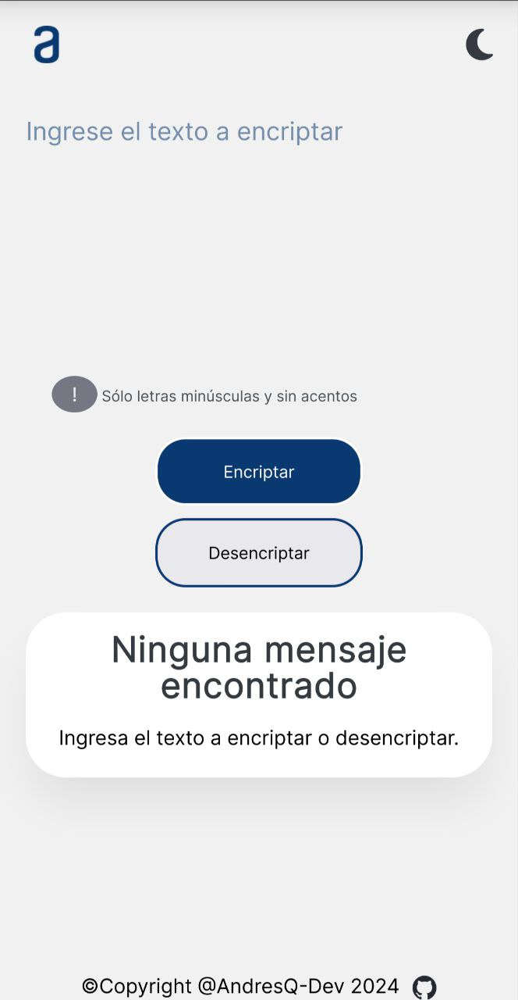
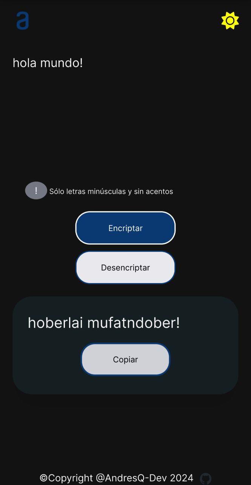
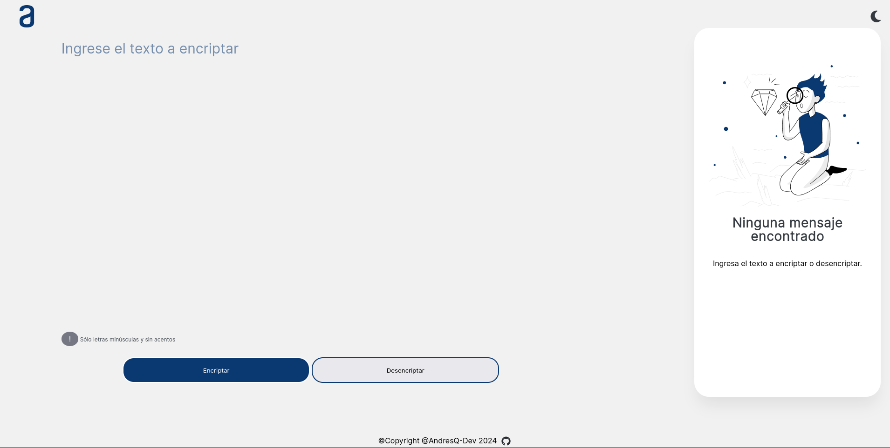

# Encriptador de texto

## Sencilla aplicación web responsive para encriptar y desencriptar mensajes de texto cortos.

### Pruebala [aquí](https://andresq-dev.github.io/Crypto/)

## Funciones
-Encripta y desencripta texto.

-Botón para copiar al portapapeles el mensaje encriptado.

-Opción de tema Claro/Oscuro.

-PopUp para confirmar copiado.

-Adaptable a moviles

## Screenshots

<table>
  <tr>
    <td align="center">
      
    </td>
    <td align="center">
      
    </td>
  </tr>
  <tr>
    <td align="center" colspan="2">
      
    </td>
  </tr>
</table>